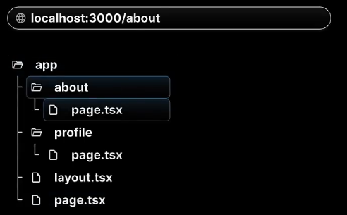

# scenarion 1  
  
let create project: `routing-demo`  & clean src folder  
  
here we cleaned the entire `/src` folder.  
now lets create `/app` directory & create `page.tsx` inside it.  
`/src` -----> `/app` -----> `page.tsx`  
```typescript
export default function Home(){
    return <h1>Home Page</h1>
}
```    
```bash
npm run dev
```  
  
it creates `layout.tsx` automatically  
  


# scenarion 2  
  
easy peasy lemon squeazyy  
create 2 folder 1. `about` then 2. `profile` & create `page.tsx` for wach component  
1. `/src` -----> `/app` -----> `/about` -----> `page.tsx`  
```typescript
export default function About(){
    return <h1>About Page</h1>
}
```  
2. `/src` -----> `/app` -----> `/profile` -----> `page.tsx`  
```typescript
export default function Profile(){
    return <h1>Profile Page</h1>
}
```  
  
```bash
npm run dev
```  
at `/about`  
  
at `/profile`  
  

## lets summarize this again  
at `localhost:3000/`  
  
at `localhost:3000/about`  
  
at `localhost:3000/profile`  
  

## `if we try to reach unassigned url string, it gives us 404 error`  
  

this file base routing doesn't need add routing dependancy explicitly  