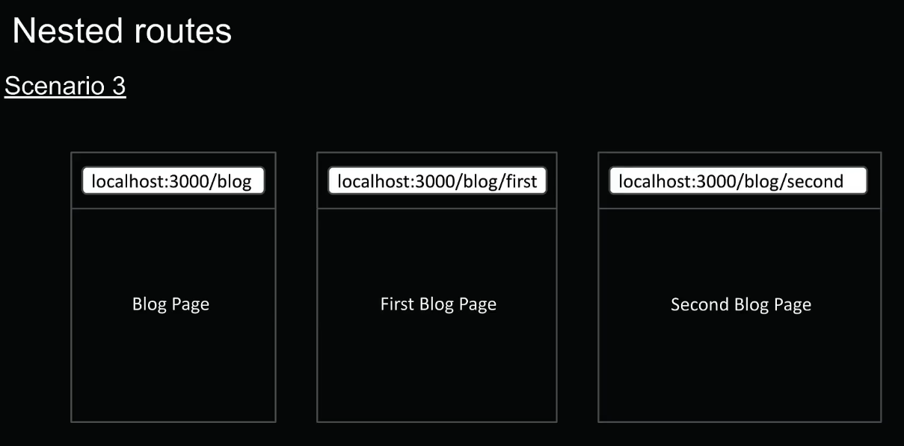
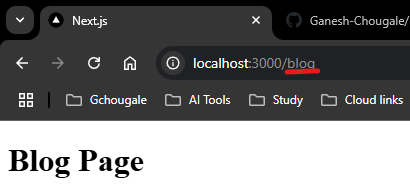
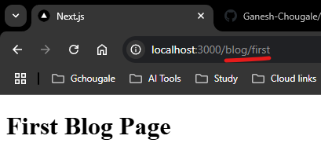
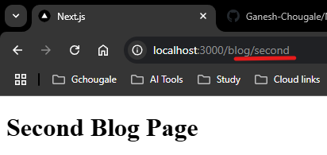
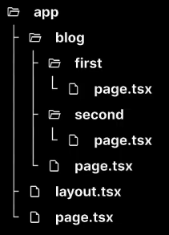

# Scenari 3  
  
1. `/src` -----> `/app` -----> `/blog` -----> `/page.tsx`  
```typescript
export default function Blog(){
    return <h1>Blog Page</h1>
}
```    
at `localhost:3000/blog`  
  
2. `/src` -----> `/app` -----> `/blog` -----> `/first` -----> `/page.tsx`  
```typescript
export default function FirstBlog(){
    return <h1>First Blog Page</h1>
}
```    
at `localhost:3000/blog/first`  
  
3. `/src` -----> `/app` -----> `/blog` -----> `/secord` -----> `/page.tsx`  
```typescript
export default function SecondBlog(){
    return <h1>Second Blog Page</h1>
}
```  
at `localhost:3000/blog/secord`  
    

## the summary of files & folder structure
    