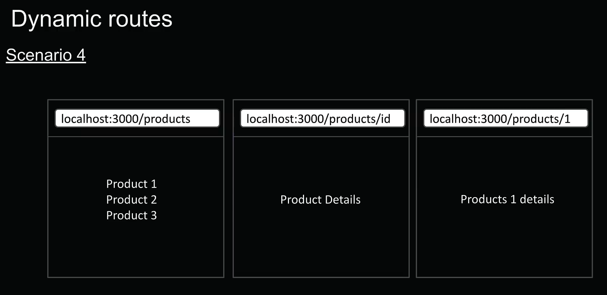
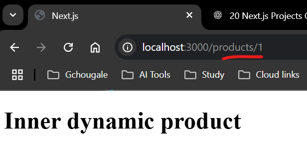
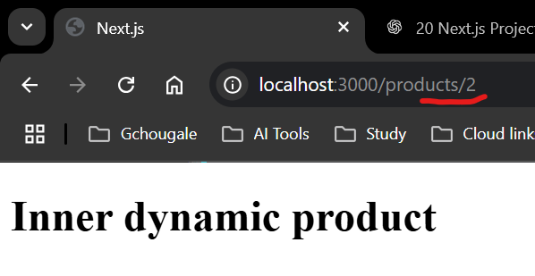
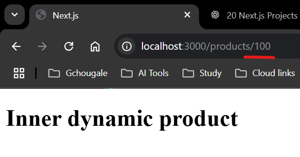

# Scenario 4  

  
1. `/src` -----> `/app` -----> `/products`  
`Page.tsx`  
```typescript
export default function ProductList(){
    return (
        <>
        <h1>Product List</h1>
        <h2>Product 1</h2>
        <h2>Product 2</h2>
        <h2>Product 3</h2>
        </>
    )
}
```  
now for each product we can create folder by its id number like `/1`, `/2`.. & can create their own `/page/tsx` but what if we have 100s of products, this will kill DRY principle.  

instead of this, we can create folder `[productid]`                     
& give content inside it.  
2. `/src` -----> `/app` -----> `/products` -----> `/[productid]`  
`/page.tsx`  
```typescript
export default function ProductDetails(){
    return <h1>Inner dynamic product</h1>;
}
```  

now no matter what is id it will render that page  
`localhost:3000/products/1`  
  
`localhost:3000/products/2`  
  
`localhost:3000/products/100`  
  
